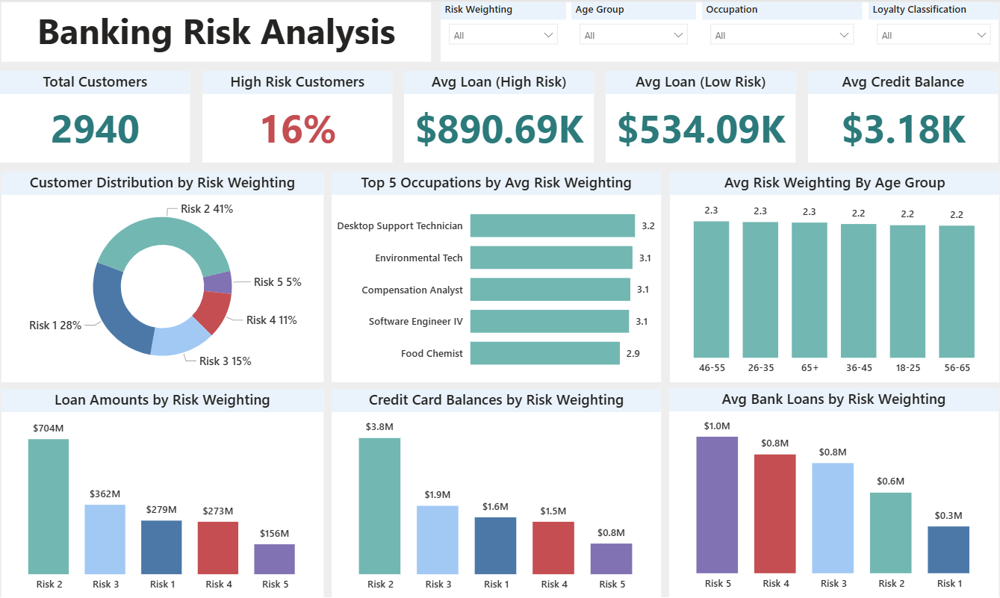
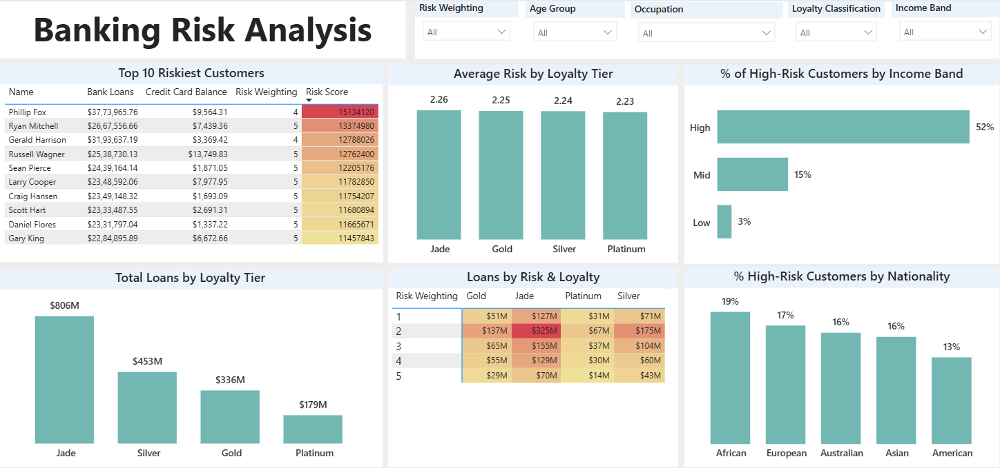

# 🏦 Banking Risk Analysis – Customer Risk & Loan Exposure  

Analyzing customer credit risk and loan exposure using **MySQL, Python, and Power BI**.  
This end-to-end project connects raw banking data from a database, performs exploratory data analysis (EDA) and statistical tests in Python, and builds an interactive Power BI dashboard for decision-making.  

---

## 📑 Table of Contents
- [📌 Overview](#-overview)  
- [❓ Business Problem](#-business-problem)  
- [🗄️ Dataset](#%EF%B8%8F-dataset)  
- [🛠️ Tools & Technologies](#%EF%B8%8F-tools--technologies)  
- [📂 Project Structure](#-project-structure)  
- [🧹 Data Cleaning & Preparation](#-data-cleaning--preparation)  
- [🔎 Exploratory Data Analysis (EDA)](#-exploratory-data-analysis-eda)  
- [📊 Research Questions & Key Findings](#-research-questions--key-findings)  
- [📈 Dashboard](#-dashboard)  
- [⚙️ How to Run This Project](#%EF%B8%8F-how-to-run-this-project)  
- [✅ Final Recommendations](#-final-recommendations)  
- [👤 Author & Contact](#-author--contact)  

---

## 📌 Overview  
This project evaluates customer risk exposure and loan dynamics to help banks understand **which customer segments are most likely to default**.  
It follows a full analytics workflow: **data extraction (SQL) → EDA & statistics (Python) → dashboarding (Power BI).**  

---

## ❓ Business Problem  
Banks face challenges in managing **credit risk** across different customer segments. This project aims to:  
- Identify which **occupations, age groups, and income bands** are most risky  
- Compare **loans and credit card balances** across risk categories  
- Assess risk differences across **loyalty tiers (Platinum, Gold, Silver, Jade)**  
- Identify the **Top 10 riskiest customers** driving exposure  
- Provide **data-driven insights for monitoring & decision-making**  

---

## 🗄️ Dataset  
- Customer demographic, loan, and transaction data extracted from **MySQL**  
- Key attributes:  
  - `Bank Loans`, `Credit Card Balance`, `Risk Weighting` (1–5)  
  - `Occupation`, `Age Group`, `Income Band`, `Loyalty Classification`, `Nationality`  
- Derived fields:  
  - `High Risk` flag (Risk Weighting ≥ 4)  
  - `Risk Exposure Score = (Bank Loans + Credit Balance) × Risk Weighting`  

---

## 🛠️ Tools & Technologies  
- **SQL (MySQL)** → Data extraction  
- **Python (Pandas, Matplotlib, Seaborn, SciPy, Statsmodels)** → EDA & hypothesis testing  
- **Power BI** → Interactive dashboards (KPIs, slicers, heatmaps, charts)  
- **GitHub** → Version control & project documentation  

---

## 📂 Project Structure  
```
banking-risk-analysis/
│
├─ notebooks/
│ └─ banking_risk_analysis.ipynb # Python analysis & EDA
│
├─ dashboard/
│ └─ Risk_Analysis_Dashboard.pbix # Power BI dashboard file
│
├─ data/
│ └─ Banking_sample.csv # Sample dataset (anonymized)
│
├─ images/
│ ├─ risk_overview.png # Page 1 dashboard
│ ├─ customer_segments.png # Page 2 dashboard
│ ├─ risk_vs_exposure.png # Python plot
│ └─ occupation_risk.png # Python plot
│
├─ requirements.txt # Python dependencies
└─ README.md
```
yaml
Copy code

---

## 🧹 Data Cleaning & Preparation  
- Removed duplicates, invalid values (e.g., negative loans)  
- Created **age groups** and **income bands**  
- Encoded categorical features (occupation, nationality, loyalty tier)  
- Generated derived metrics: `High Risk`, `Risk Exposure Score`  

---

## 🔎 Exploratory Data Analysis (EDA)  

**Sample Visuals:**  

📊 Average Loan vs Credit Card Balance by Risk Category  
  

📊 Top 5 Occupations with Highest Average Risk  
  

---

## 📊 Research Questions & Key Findings  

1. **Which occupations and age groups tend to fall in higher risk brackets?**  
   → Certain job roles and middle-aged groups had higher average risk.  

2. **Is there a difference in risk between male and female customers?**  
   → Minimal differences; gender is not a strong predictor.  

3. **Do high-risk customers hold more loans compared to low-risk customers?**  
   → Yes, loan size increases significantly with risk weighting.  

4. **Does higher loyalty classification (Platinum, Gold) align with lower risk?**  
   → Yes, Jade tier is associated with higher-risk loans.  

5. **Who are the Top 10 riskiest customers by exposure?**  
   → A small group of customers contribute **~2.5% of total exposure**.  

---

## 📈 Dashboard  

### 🔹 Page 1: Risk Overview  
  
- KPIs: Total Customers, % High Risk, Avg Loan (High vs Low Risk), Avg Credit Balance  
- Risk distribution by **weighting, age group, occupation**  
- Loan vs Credit balance by risk  

### 🔹 Page 2: Customer Segments  
  
- Risk & loan breakdown by **loyalty tier**  
- Heatmap: Loans by **Risk × Loyalty**  
- % High-Risk Customers by **Income Band** and **Nationality**  
- Top 10 Riskiest Customers table  

---

## ⚙️ How to Run This Project  

1. Clone the repo:  
   ```bash
   git clone https://github.com/<your-username>/banking-risk-analysis.git
   cd banking-risk-analysis
Install dependencies:

bash
Copy code
pip install -r requirements.txt
Run Jupyter Notebook:

bash
Copy code
jupyter notebook notebooks/banking_risk_analysis.ipynb
Open Power BI dashboard:

File: dashboard/Risk_Analysis_Dashboard.pbix

---

✅ Final Recommendations

- Monitor high-income and Jade tier customers closely  
- Use risk-weighting + loan exposure for early-warning systems  
- Diversify loan portfolios to reduce concentration risk  
- Combine demographics + financial behavior for better scoring models

---

👤 Author & Contact
👤 Rajat Rawat – Data Analyst
📧 Email: [rajatrawatofficial98@gmail.com]
🔗 [LinkedIn](https://www.linkedin.com/in/rajat-rawat-3791a422a/)